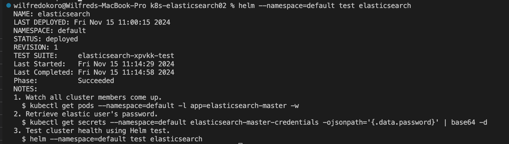

## Deploying Elasticsearch in Kubernetes

### update the eks cluster
```bash
aws eks update-kubeconfig --name demo
```

### Elastic Stack Helm Chart
```bash
helm repo add elastic https://helm.elastic.co
helm repo update
```
### Download and create values.yaml 
#### This will create values.yaml in the directory allocated
```bash
wget https://raw.githubusercontent.com/elastic/helm-charts/main/elasticsearch/values.yaml -O elastic-values.yaml
```
### Install Elasticsearch using Helm Chart

```bash
helm install elasticsearch --values elastic-values.yaml  elastic/elasticsearch
```
### Output file copy to a clipboard


<!-- 1. Watch all cluster members come up.
  $ kubectl get pods --namespace=default -l app=elasticsearch-master -w
2. Retrieve elastic user's password.
  $ kubectl get secrets --namespace=default elasticsearch-master-credentials -ojsonpath='{.data.password}' | base64 -d
3. Test cluster health using Helm test.
  $ helm --namespace=default test elasticsearch
wilfredokoro@Wilfreds-MacBook-Pro k8s-elasticsearch02 %  -->


### Watch all cluster members come up:
```bash
kubectl get pods --namespace=default -l app=elasticsearch-master -w
```


### Retrieve elastic user's password.:

```bash
kubectl get secrets --namespace=default elasticsearch-master-credentials -ojsonpath='{.data.password}' | base64 -d
``` 


### Test cluster health using Helm test:

```bash
helm --namespace=default test elasticsearch
```



