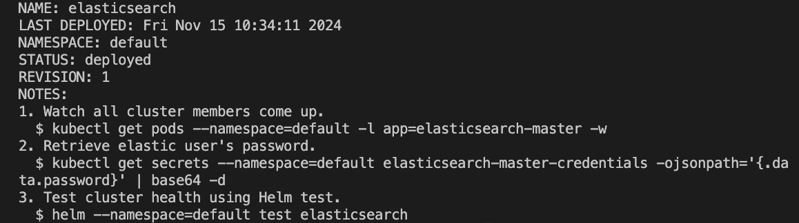
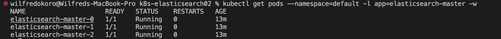

# Deploying Elasticsearch in Kubernetes

## Create the Namespace for Elasticsearch

```bash
kubectl create namespace elasticsearch
```

## Deploy the Elasticsearch StatefulSet and Service

### Save the following YAML as elasticsearch-deployment.yaml

```bash
apiVersion: apps/v1
kind: StatefulSet
metadata:
  name: elasticsearch
  labels:
    app: elasticsearch
spec:
  replicas: 1
  selector:
    matchLabels:
      app: elasticsearch
  template:
    metadata:
      labels:
        app: elasticsearch
    spec:
      containers:
      - name: elasticsearch
        image: elastic/elasticsearch:7.17.2
        env:
        - name: discovery.type
          value: single-node
        - name: ELASTIC_PASSWORD
          value: "elasticstack"
        - name: xpack.security.enabled
          value: "true"
        - name: xpack.security.transport.ssl.enabled
          value: "true"
        - name: ES_JAVA_OPTS
          value: "-Xms500m -Xmx1000m"
        ports:
        - containerPort: 9200
        - containerPort: 9300
        volumeMounts:
        - name: elastic-data
          mountPath: /usr/share/elasticsearch/data
      volumes:
      - name: elastic-data
        emptyDir:
          sizeLimit: 5Gi
---
# Elasticsearch services

apiVersion: v1
kind: Service
metadata:
  labels:
    app: elasticsearch
  name: elasticsearch-master
spec:
  ports:
  - name: elasticsearch
    port: 9200
    protocol: TCP
    targetPort: 9200
    nodePort: 32000 
  - name: elisticsearch-ssl
    port: 9300
    protocol: TCP
    targetPort: 9300
  selector:
    app: elasticsearch
  type: NodePort  # ClusterIP
```

### Apply this file to create the StatefulSet and Service:
```bash
kubectl apply -f elasticsearch-deployment.yaml -n elasticsearch
```

### Once the service is created, get the external IP address:

```bash
kubectl get svc -n elasticsearch

kubectl get nodes -n elasticsearch -o wide
``` 




### In your browser, visit:

```bash
http://<EXTERNAL-IP>:32000
```




